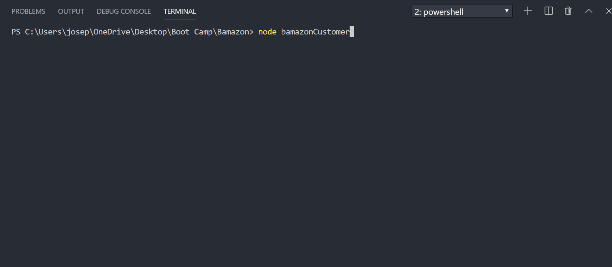
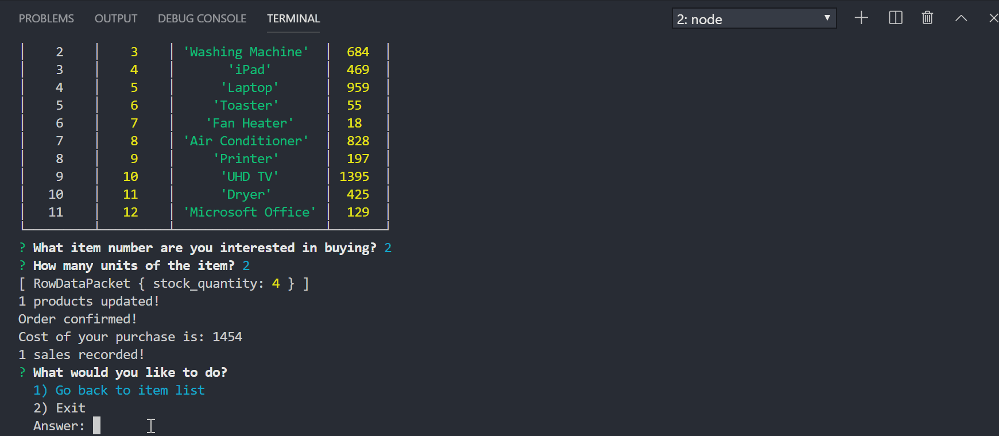
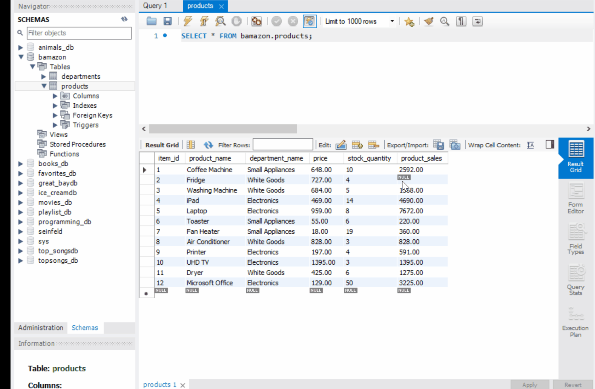
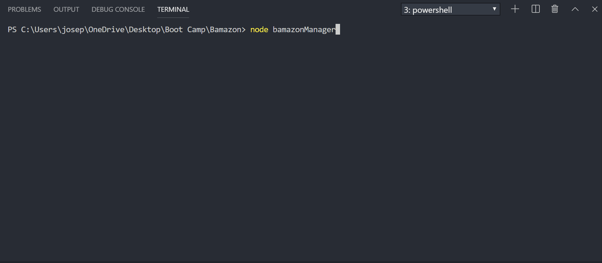
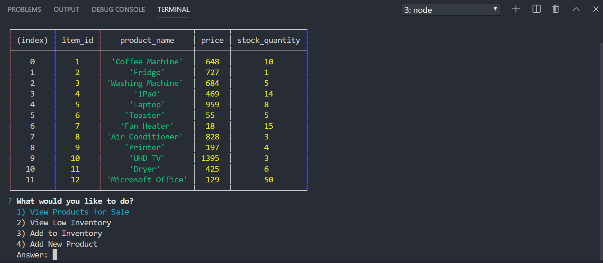
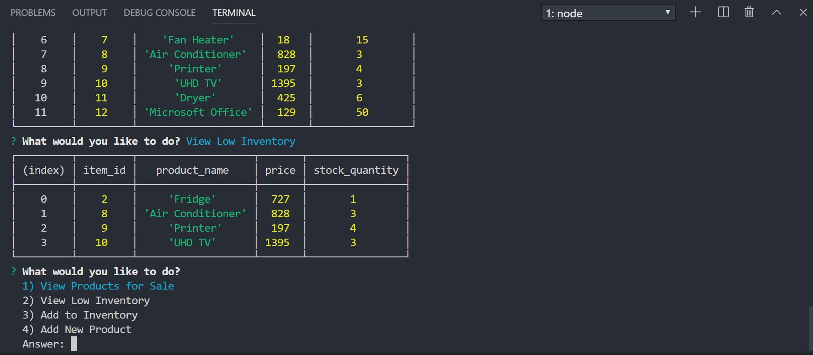
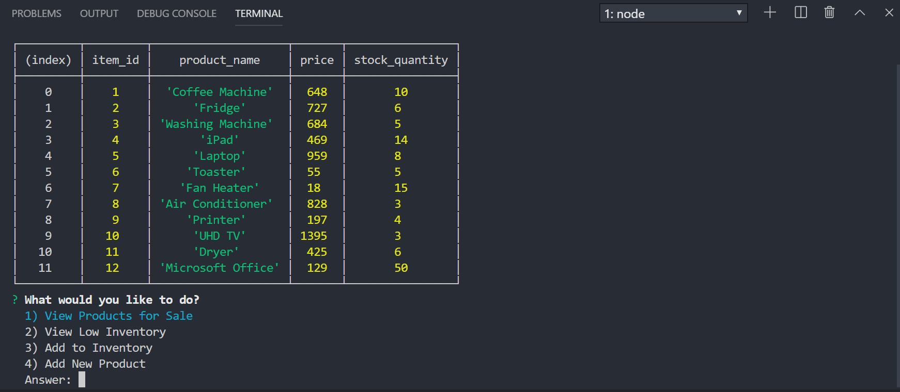
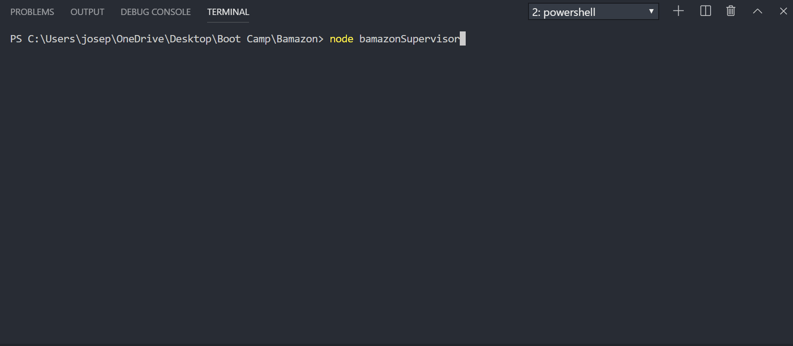
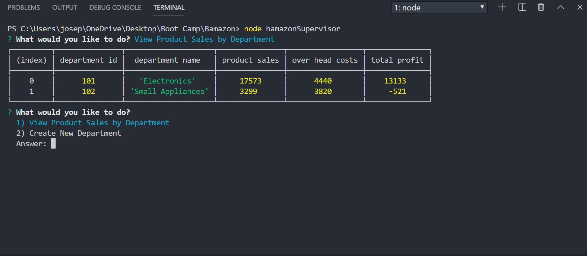

# Bamazon

## About

Bamazon is a basic version of the average store retail system that allows

1. Customers to purchase goods online
2. Store managers to manage their inventory
3. Store supervisors to view the sales performance of goods by department

## Technologies

Bamazon is a :

1. Node-only retail store system that takes commands from all parties
2. through prompts (inquirer) and
3. stores the impact of commands executed on inventory and sales in a mySQL database.

## Instructions

There are three modules involved in the construction of Bamazon. They are the Customer, Manager and Supervisor modules. In order to display the full functionality of the modules, a database of 10 retail items have already been created in the mySQL database which contains the following data:

1. item_id
2. product_name
3. department_name
4. price (retail)
5. stock_quantity

Instructions for creating the corresponding bamazon database in mySQL is contained within Bamazon-Schema.sql and the corresponding initial 10 item data is within the Bamazon-Seeds.sql.

All the following instructions are to be executed via terminal with node.js and mySQL installed and connected.

### 1. Customers:

`node bamazonCustomer`

Executing this command will first display all of the items available for sale with their IDs, names, and prices.

This is followed by two prompts for the user:

- The first should ask them the ID of the product they would like to buy.
- The second message should ask how many units of the product they would like to buy.

The answers would be used to locate the item_id from the bamazon database in mySQL and check if there is enough quantity to fulfill the order.

- If sufficient, order will go through.
  User would be notified of the price of the purchase and in mySQL:

  - the inventory of the corresponding item will be reduced and
  - the sale will be recorded.

-

  
   Example 1: 2 fridges are ordered. Stock quantity is 4. Order goes through.

- If insufficient, user would be notified.
  User is then given a chance to adjust their quantity for the same item or offered to return to the main menu.

  
  Example 2: 3 fridges are ordered. Stock remaining is 2. Order fails. User adjusts quantity to 1. Order goes through.

  
  Sale of 3 fridges ordered from Example 1 and 2 are recorded in mySQL.

### 2. Managers:

`node bamazonManager`

Running this application will list a set of menu options:

    - View Products for Sale
    - View Low Inventory
    - Add to Inventory
    - Add New Product

If a manager selects `View Products for Sale`, the app should list every available item: the item IDs, names, prices, and quantities.

   

If a manager selects `View Low Inventory`, then it should list all items with an inventory count lower than 5.

   

If a manager selects `Add to Inventory`, the app displays a prompt that will let the manager "add more" of any item currently in the store.

  
    *Example 3: 5 fridges are added to remaining 1. Full item and low inventory list reflect change.*

If a manager selects `Add New Product`, it allows the manager to add a completely new product to the store.

  

### 3. Supervisors:

`node bamazonSupervisor`

Running this application will list a set of menu options:

    - View Product Sales by Department
    - Create New Department

When a supervisor selects `View Product Sales by Department`, the app should display a summarized table in their terminal/bash window.

The supervisor also has the ability create a new department via the console, which can pick up any existing product sales related to that department created.

## Link to Deployment

Not Applicable as this can only be run from Node
